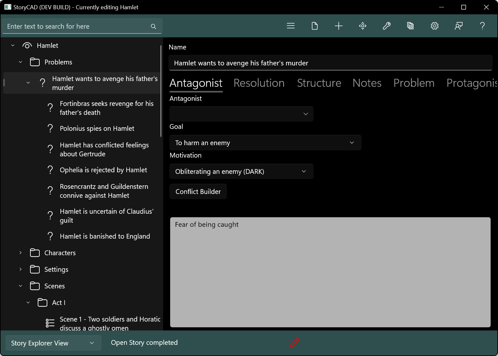

### Antagonist Tab ###
Antagonist Tab

The problem's antagonist is the source of the opposition to the problem protagonist's goal.

Don't automatically assume that the antagonist is a villain.  Your antagonist should have perfectly valid reasons for opposing your protagonist--- when seen from his point of view.  He may even think of himself as the hero.  

On the other hand, don't hesitate to use negative traits such as vices or prejudices, base motives, or aspects of the Shadow archetype in casting your antagonist if the story calls for it.

Antagonist

This control is a list of the characters who have been defined on the Characters form.  Select one of these characters from the list.

The antagonist may not be a person.  If the conflict type is 'Person against Nature', for instance, the antagonist might be a mountain or a fire.  In this case, you may want to consider defining a character for the non-human antagonist, and possibly personifying this force with human traits.
 
The antagonist may also be the same character as the protagonist, in the case of 'Man against Himself' conflicts.

Goal, Motivation, Conflict Builder, Conflict

  
  
[Previous - Problem Form](Problem_Form.md)  
[Next - Resolution Tab](Resolution_Tab.md)  
