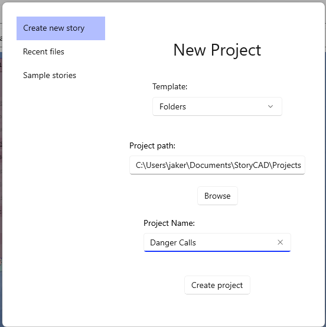
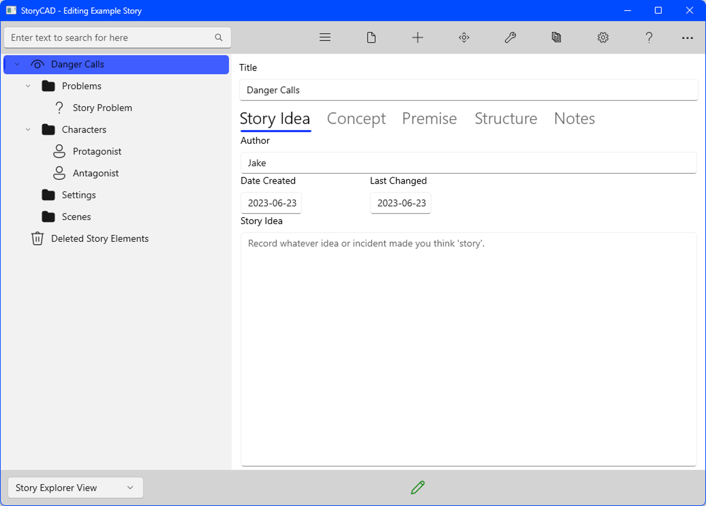
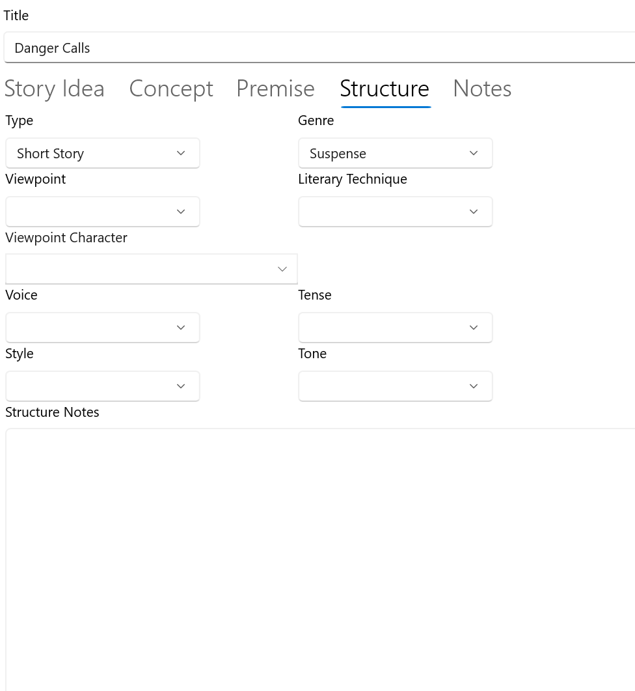

## Creating a Story pt 1 ##
Creating a Story  

The best  way to learn about StoryCAD is to actually create a story with it.  That's what this tutorial is for.  We'll create a story outline with StoryCAD and show you exactly what we did at each step along the way. We don’t claim it’s a great outline; actually, it’s pretty trite. But the point is that any story idea, with work and process, can be developed into a workable story.  

The tutorial assumes you can navigate in StoryCAD, so if you haven’t yet done so, please take a look at the Quick Start  section of this manual, and particularly at the Navigating in StoryCAD subsection. That  said, let’s begin.  

Every story starts with an idea. The idea might come from anywhere.  A conversation might lead to a bit of dialog; someone you see in a crowd could suggest an interesting character; a newspaper article or story you're read or movie you've seen might spark an idea for a conflict.    

Our idea started with a television news piece which showed young gang members, boys as young as fourteen, selling drugs on the street.  We were stricken by the image of these young criminals using technology such as disposable cell phones, and thought there was a story in there someplace.  

Regardless of where the idea comes from or how complete it is, at the moment of conception it’s all you have, and it’s a good idea to capture it lest you lose it. That’s why it’s a good idea to jot those ideas down when they occur in some form: in a notebook, or on your phone.   

To do so in StoryCAD, launch the program. The first time you launch the program, you’ll be prompted to your update your user preferences. One option is your Project directory. Although StoryCAD remembers and displays your last outline location, this value is its default starting location.  You should also set your backup options.   

Back to our story idea. Use the File menu’s  Open/Create file option:  

Click on Create New Story to start a new outline:  

Select ‘Folders’ for the Template. If it’s not already there, change the Project path to the folder you’d like to save your outline in (usually the Preferences location) using the Browse button. And finally, assign a Project Name. This will be the file name of the story outline file. In our case, use ‘Danger Calls’. Click on Create project, and you’ll have created your first story outline:  

Note the green pencil on the Status Bar at the bottom of the page. The green indicates that the story outline has been saved to disk:  

Click on the  Story Overview node in the navigation pane:  

The content pane will show this node’s (empty) tabs and be sitting on the empty Story Idea tab:  

You can click on any of the tabs to display that tab’s contents.  

You'll notice that the Author, Date Created and Last Changed fields are already filled in.  The author's name is taken from your name as entered in Preferences. For a new outline, Date Created is today's date, and for a new or old outline, and Last Changed is the computer date on which a change to the outline was last made.   

Key whatever notes you like regarding your idea. While we're here, we might as well fill out a few other items.   

At the moment, the story outline for "Danger Calls" exists only in your computer's memory, but isn’t saved to disk.  Let's save what we've done so far.  We recommend you save your work frequently, and provide a number of ways to do so.  The simplest is to click on the status bar’s Changed Indicator:  

.png)

The indicator will change from red to green, indicating that all changes have been saved to disk.  

Alternatively, from the File menu, you can select Save Story, or enter the Ctrl+S shortcut keys.  Remember to save your work periodically.  

As we said in the beginning, an idea can come form anywhere: a bit of dialog, a possible character, a subject from an article or another story. You want to capture as much of that as possible. If it’s a character or a bit of dialog, create a Character story element. If it’s a location or situation, create a Setting story element. if it’s an event, create a Scene story element. If it’s a newspaper article or story you’ve read or movie you seen, describe it on the Story Idea tab. Encourage and trust your muse: whatever it was that made you think ‘story’, save it. For now, for “Danger Calls”, we don’t have any of these, just the idea as recorded.  

This is a good place to talk about workflow. Workflow is discussed more fully in Writing with StoryCAD, but the idea’s pretty simple. Your story outline is comprised of a number of story elements, and each story element is organized as one or more tabs. Each tab focuses on one aspect of the story element. A story outline always contains and starts with one story element, the Story Overview, and so far you’ve filled in one tab, the Story Idea. Every story starts with a story idea, and recording it is the first step in your workflow.  

Click on the Danger Calls node’s Structure tab. As is described in the Quick Start, this tab is concerned with constraints on the order and form you place on your story, and contains a number of user interface controls for this purpose. Our story idea’s about crime and criminals, so let’s pick a genre for that. Clicking on the down-arrow key on the Genre ComboBox will display a list of choices; we’ll choose Suspense.  Set Type to Short Story (to keep our example brief.) StoryCAD has many drop-down lists. Not all lists are editable, but for the most part they’re not exhaustive, and  are editable: you can enter values other than the provided options. The lists are examples, suggestions; they’re not there to limit your creativity, but to encourage it.   

The Structure tab on the Story Overview is important not necessarily at the moment of conception, but early in story development, because it constrains other choices. Type affects story length and complexity, and Genre sets reader expectations: to be amused for a humor piece, to have a mystery to solve in a mystery, etc.  

When you’re done with an editing session, you can Close your outline using the File Menu and open a different outline, or exit the program. Be sure to save your work.  

  
  
[Prev](Notes_Form.md)[Next](Creating_a_Story_pt_2.md)  
