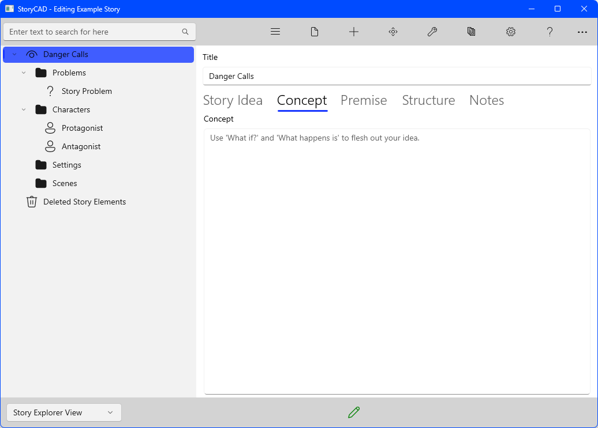
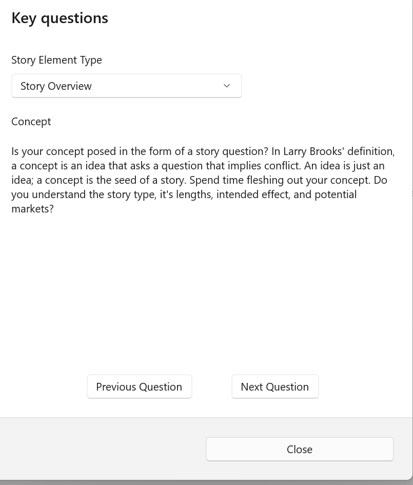
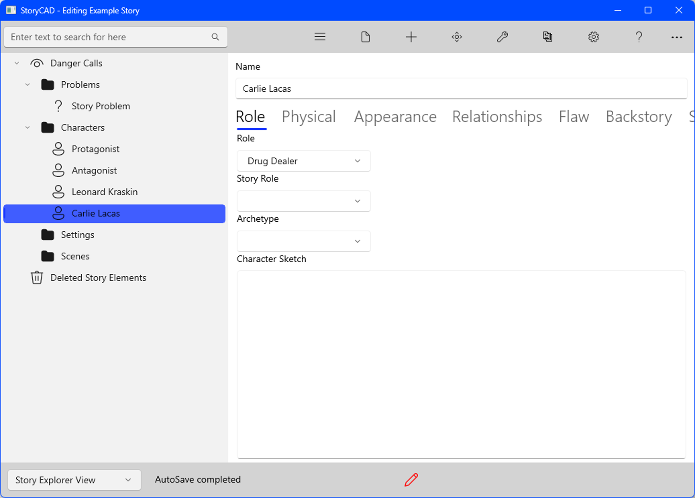

## Creating a Story pt 2 ##
After a break, we decide to continue refining our story idea.  You need to reload the "Danger Calls" outline. Launch StoryCAD. 

 StoryCAD displays the File Open menu by default when launched,  and displays the last files you worked on the menu form. You can mouse over any of these files to see more details (like the file location.) If you haven’t edited the story you’re looking for in a while and it’s not on the list, Click the ‘Open story from disk’ button and browse for it. You can work on multiple story outlines in one StoryCAD session, but StoryCAD can only work with one story outline at a time. 

At this point we've recorded the initial story idea.  However, there's a great gulf between a story idea and a finished story.  At rare intervals, a story idea may spring forth so complete and well formed that it practically writes itself.  Most ideas, though, are fragments--- a scene, a character, a situation (like this one), an ending, or something else.  The next step is to convert this fragment, this idea, into a concept.

In the literature of fiction writing, concept is a a term which is often misused and misunderstood; it’s conflated with ‘story idea’ and ‘premise’ and ‘theme’. If you think of a fiction writing workflow, it’s clear that there’s an intermediate step between story idea and premise. That’s concept. Larry Brooks, in his book Story Engineering, defines it this way: ‘A concept is an idea that asks a question that implies conflict.’  

Click on the Concept tab on your Story Overview and you’ll see this:

The note displayed is called a ToolTIp, and you’ll find many of these in StoryCAD. It will be replaced with your text as soon as you start keying into the text box.

Writing is thinking, and asking questions is at the core of critical thinking. Think of your concept as framed in the form of a question (or questions). The answer to that question is your story. If the question implies conflict, it’s a potentially effective story. 

Brooks offers the following example: a story idea might be to write a story about ballet dancers. A concept might be ‘What if a ballet dancer looses her leg at the knee but perseveres against great prejudice to become a professional dancer?’

For the “Danger Calls” concept, let’s use this:
 

(Don’t forget to save.) 

One nice thing about a question is that it can be refined by subsequent questions. A concept question often leads to other questions; The term ‘high concept’ is often used to describe a concept that will appeal to a wide audience, and is often a concept with broad possibilities. The da Vinci Code is an outstanding example of this.

But questions can also be used to refine and test concepts and many other store elements. StoryCAD contains a tool, Key Questions, for just  this purpose. 

Launch Key Questions from the Tool menu (use the wrench icon on the Menu Bar.) With Story Overview selected in the ComboBox, click Next Question until you find the first Concept question:

Key Questions can help you refine any story element or workflow step.

As is discussed in the Story Elements and Tabs topics in the Quick Start, a story outline is a collection of story elements organized below a Story Overview root node. These nodes are orthogonal to each other in the sense that they’re separate and independent, but they’re also interrelated. For example, a Scene node has a cast of Character nods and a location (a Setting node.)  

We can continue to work on the "Danger Calls" concept from any direction, adding Problem, Setting, or  Scene story elements, but let's start with something implicit in our Concept, some key characters.  Outlines are built by aggregation, adding bits and pieces as they occur to you, or as you reason things out. As a 'cops and robbers' story,  “Danger Calls”  has two obvious character archetypes, cop and criminal. Right-click on the Character Folder. You’ll see a ‘fly-out menu’ open:

The icons to the left of the first separator represent different story element types, and clicking on one of them will insert that as a child of the node you right-clicked. Click on the Character icon (if you want to know what a button is, just mouse over it.) You’ll insert a ‘New Character’ Character story element under the empty Characters folder. Click on the ‘New Character’ node and give your character a name. We also know the role we want, so pick that:

Give him the Story Role of Protagonist and move him to the characters folder.

We can also add a second character, the bad guy, the same way: 

You can set him as the Antagonist.

Notice that the list of roles doesn’t have an entry for Drug Dealer, so this was just keyed in. Most StoryCAD controls have lists of possible entries, but these lists are intended to be suggestions, not limitations. You can key whatever you want into most of these fields.

While we’re at it, let’s add a third character, another detective who’s a partner to Leonard. We’ll give him the name Tony Irwin.

Why a third character? There’s no concrete reason at this point in the outline’s development, but policemen often work in teams. Besides, with two detectives, there’s somebody to talk to. At some point in the story we’re likely to need to narrate events, to explain what’s going on and to develop plans of action. ‘Buddy’ roles are good for that. And if we don’t need Tony, a touch of the Delete button can always get rid of him.

At this point all three characters are stick figures, just names and roles. But that’s okay, we’re making progress.

Remember to save your work frequently.

    
[Previous - Tutorial: Creating a Story](Tutorial_Creating_a_Story.md)  
[Next - Creating a Story pt 3](Creating_a_Story_pt_3.md)  
