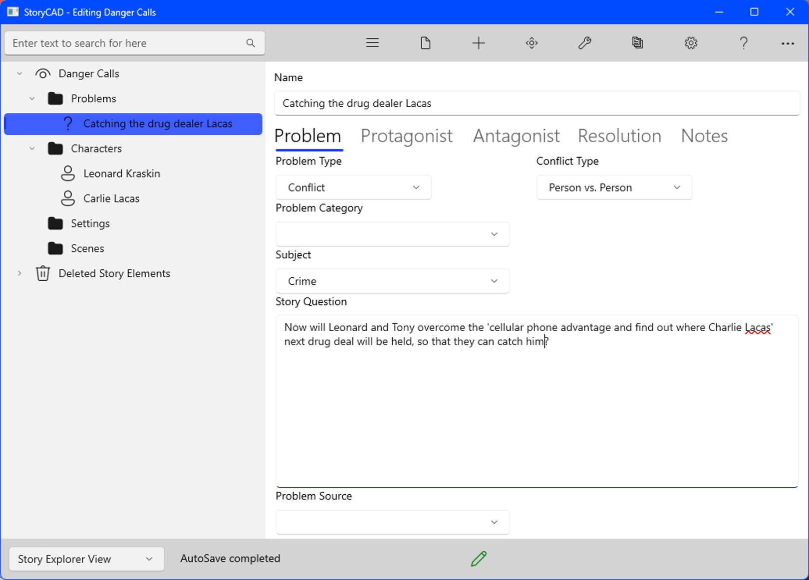
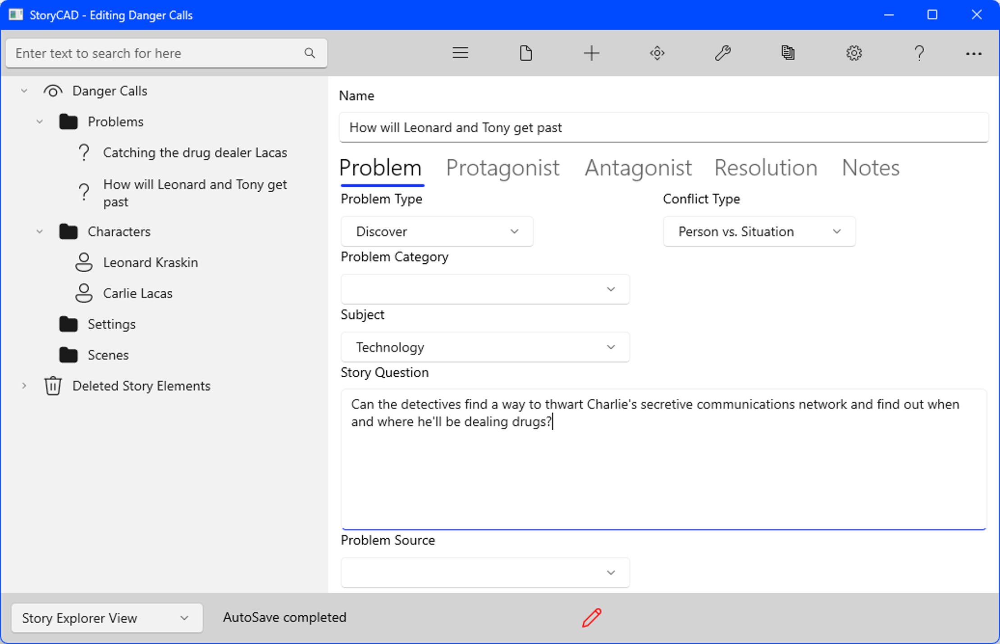

## Creating a Story pt 3 ##
So far we’ve completed the first two steps in the story workflow, Story Idea and Concept, and added a few characters. We mentioned that Concept is an intermediate step between Story Idea and Premise, so it’s no surprise that we’ll talk about your story’s Premise next. Here’s our concept again:

What if a police detective uses a criminal's phone to gain time to effect a rescue, by calling the dealer at the critical moment?

Your Premise is the answer to the question your concept poses. It’s a summary of your story told in a sentence or two.  Although there are may ways to write it, here’s a useful template:

A character in a situation [genre, setting] wants something, which brings him into conflict with a second character [opposition]. After a series of conflicts, which are handicapped by a subplot, and after a plot twist, the final battle erupts, and character one finally resolves the conflict. 

In StoryCAD, one story element type, Problem,  contains most of the elements of the Premise, and, in fact, the Problem form’s Resolution tab contains a Premise sub-element. Your story can (and usually will) contain more than one Problem, and every Problem has its own Premise. StoryCAD is centered around Problems; they’re the heart of plotted fiction.

Our immediate focus is to identify a specific protagonist with a specific problem. We have a protagonist, Leonard, and we can take a stab at a Problem. Right click on the empty Problems folder and click the ‘Add Problem’ button (the question mark.) 

Since this is a 'cops and robbers' story, and these are often action-oriented.  Let's stick to that approach; Leonard's basic problem is to catch Charlie.  This defines the Problem Type as Conflict  and the Conflict Type as Person vs. Person, so we can select these values from their drop-down lists. We said that most drop-down lists allow  you to enter new values. That’s not true for Problem Type and Conflict Type: there are only so many of those.

The basic idea for this story was a situation or subject, so we know that, too (Crime), and we can enter it as Subject. If our original idea had been a character or setting, nailing down the problem subject would be a priority, and the list of Subject values might suggest something we don’t already know. Or we might have started with a Goal for the Protagonist and found a Subject which interfered with that Goal (more on that in a bit.)

Let’s take a look at Story Question. If you’re not sure what this is or why it’s on the problem tab, use the Help (‘?’) button on the menu bar and locate the property in the user manual. Here’s what it has to say about Story Question:
The primary reason your reader reads your story is to find out how it comes out, to find the answer to a question the story poses. It’s useful to clarify exactly what that question is. The story question can be framed as a yes or no question in terms of the protagonist’s goal: ‘Will Scarlett manage to save her plantation?’, or ‘How will Macbeth prove that his father was murdered?’
Consider whether the reader should know the story’s outcome prior to the climax scene. In many character-oriented stories the answer should be yes, and the story’s dramatic arc deals with how things happen rather than what will happen. If the answer should be no, the story question is the essential suspense of the story, and your plot must serve to keep the outcome in doubt.
Focusing on our original idea again, let's say that Charlie is highly mobile, conducting his deals all over town, and that he uses a combination of pagers (yes, I know, old tech) and cellular phones to arrange the deals. Our suspenseful question might be ‘Will Leonard and Tony overcome the cellular phone advantage’ and find out where Charlie Lacas’ next drug deal will be held, so that they can catch him?’:

As is often the case, one question leads to another. We’re also faced with the question of how the detectives overcome Charlie’s tech. 

We can treat this this issue of overcoming the advantage of the cellular phones as a  complication, by rewording the problem  not as a yes or no (suspense) question but as a ‘how do they overcome?’  Story Question. Your story can (and usually will) contain more than one Problem, and every Problem has its own Premise. Let’s add our ‘how to’ question as a second problem:

Neither of these problems are fleshed out, but we’ll work on that in a minute.

  
  
[Previous - Creating a Story pt 2](Creating_a_Story_pt_2.md)  
[Next - Creating a Story pt 4](Creating_a_Story_pt_4.md)  
