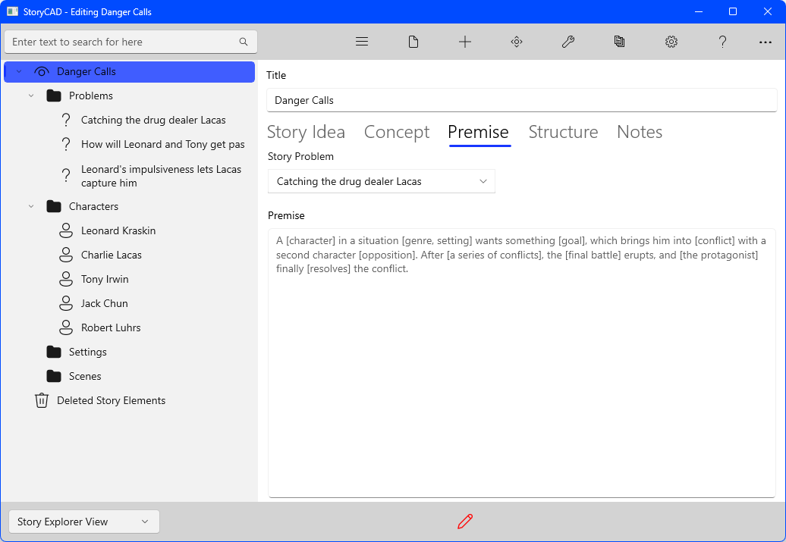
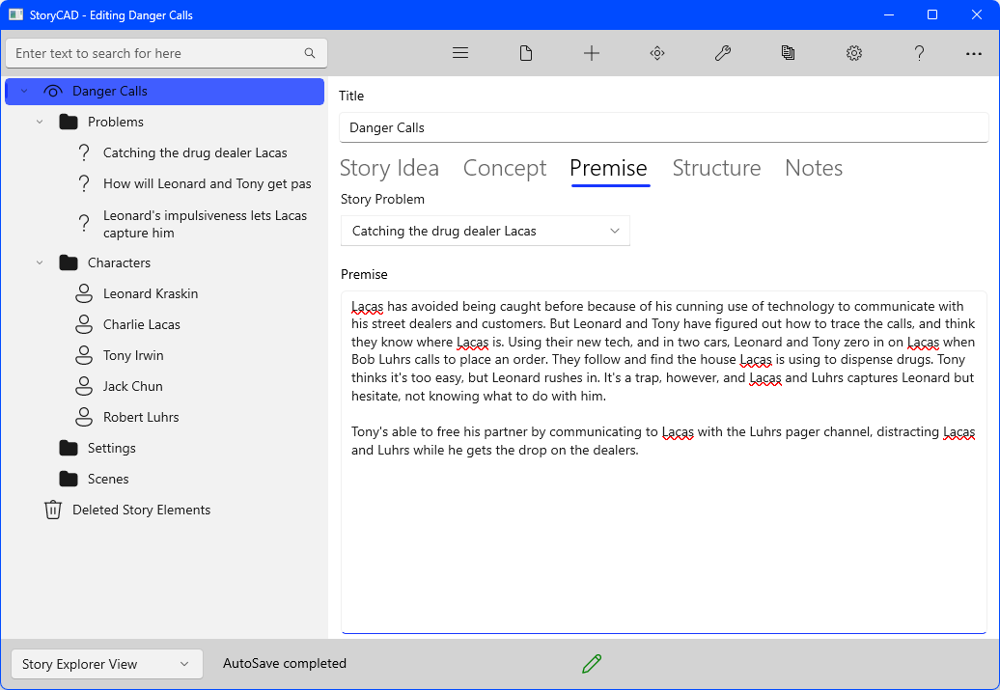
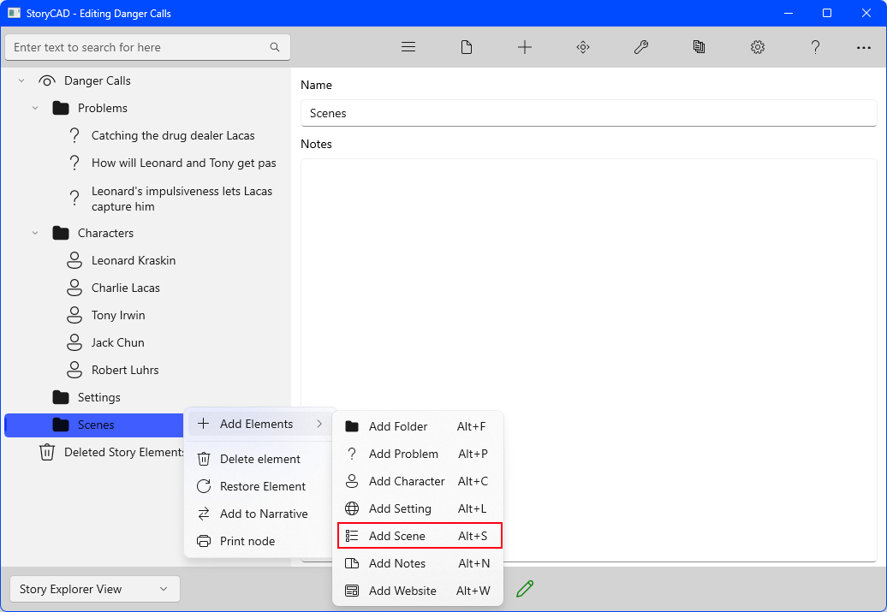
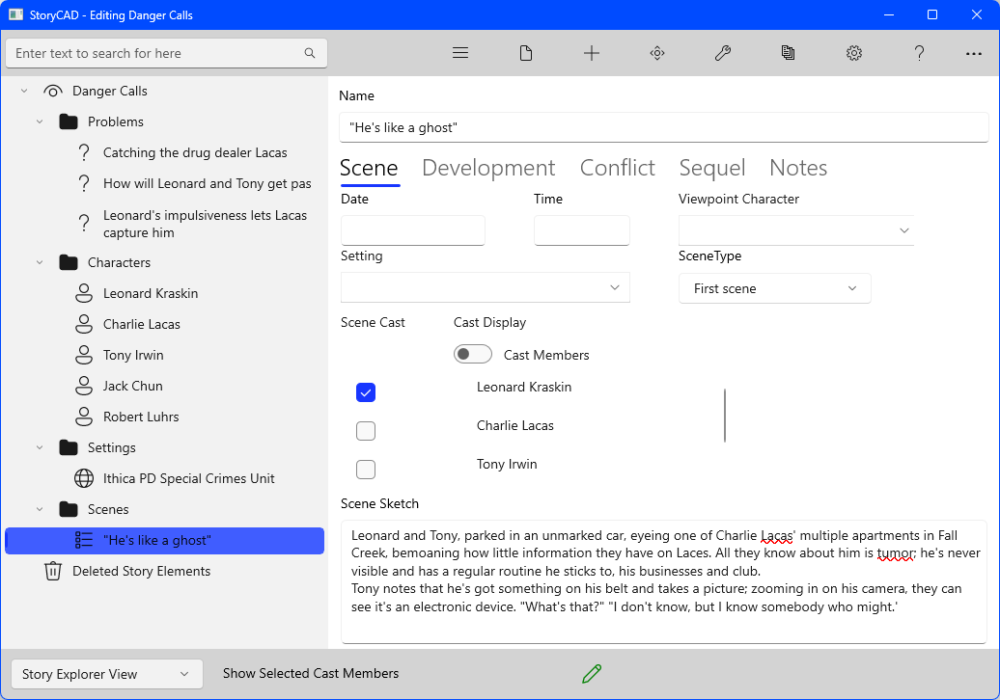
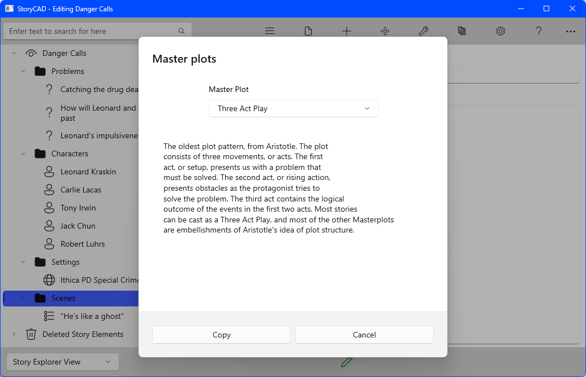
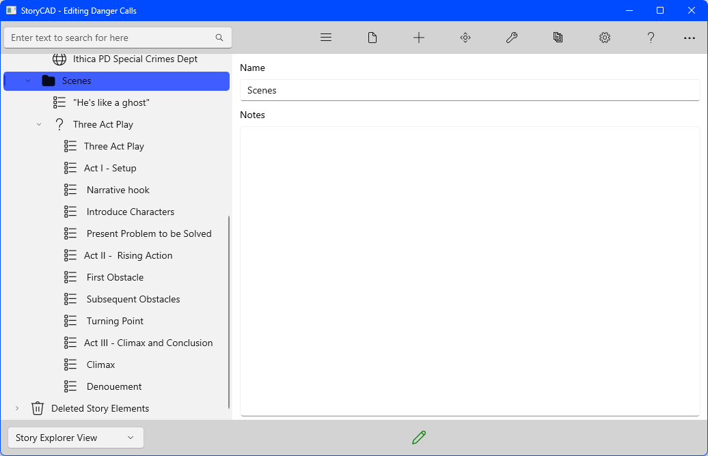
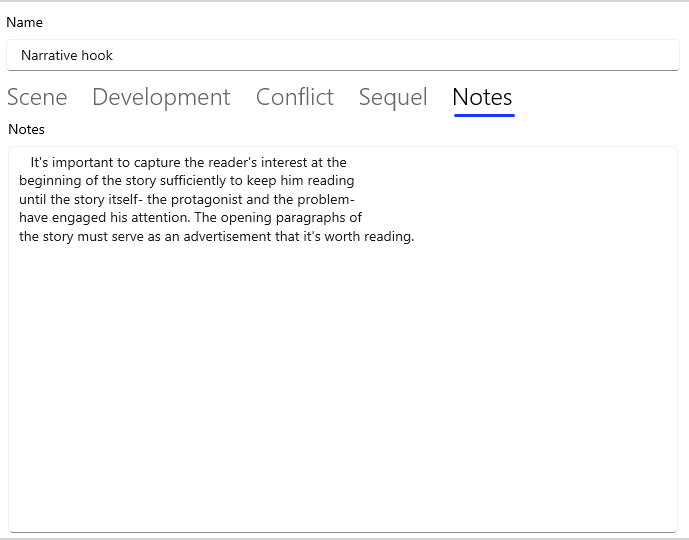

## Creating a Story pt 5 ##
The original external problem (‘Catching the drug dealer Lacas’) is solved through the resolution of the inner problem (‘Leonard's impulsiveness lets Lacas capture him’.) The story's turning point is the resolution of the inner problem, but an additional bit is needed, what we started with, getting the drop on Lacas. We should state the resolution of the external problem.  Clicking on the first problem from the list at the left of the screen, and then on the Resolution tab, allows us to key the Premise:

Lacas has avoided being caught before because of his cunning use of technology to communicate with his street dealers and customers. But Leonard and Tony have figured out how to trace the calls, and think they know where Lacas is. Using their new tech, and in two cars, Leonard and Tony zero in on Lacas when Bob Luhrs calls to place an order. They follow and find the house Lacas is using to dispense drugs.. Tony thinks it's too easy, but Leonard rushes in. It's a trap, however, and Lacas and Luhrs captures Leonard but hesitate, not knowing what to do with him.

The Premise is the same as the inner problem, with the extract bit (scene) added: ‘Tony's able to free his partner by communicating to Lacas with the Luhrs pager channel, distracting Lacas and Luhrs while he gets the drop on the dealers.’ 
1

Most stories have more than one problem, but an important thing to keep in mind is that only one of them is the story problem. The story problem’s easy to recognize: when it’s resolved: the story is over. Failure to understand that will lead to an unsatisfactory conclusion. The other Problem story elements must support that Problem, in various ways: inner vs. Outer problem, as a subplot, etc. If a Problem doesn’t relate to the story problem, it doesn’t belong to this story. The main problem is often implicit in the original story idea, but not always. You may find out which question your story is going to answer only after exploring the various problems.

StoryCAD acknowledges the need for a main story problem by having you pick the Problem that is your story problem, back on the Overview node. Overview’s Premise tab looks like this:

The Story Problem drop-down lists your outline’s Problem story elements. If you select the problem we’ve been developing you’ll see:

Note that the Premise here is just a read-only copy of the Premise on the Problem story node’s Resolution tab. Don’t forget to save your work- the red pencil on the Status bar is a reminder that you have unsaved work. You may want to take a look at the various backup and autosave options available in Preferences.

Your workflow may be different, but we recommend focusing on Problem and Character story elements to the degree that you know your major characters and their problems, know how your problems relate to each other, and know which problem is your story problem. When you know these things, you’re ready to start plotting.

Back when we started, we envisioned a scene in which Lacas walks out of the courtroom, a free man, talking on his cellular phone to someone, and laughing at Leonard, because of lack of evidence. That might be a good way to introduce the story, but our research suggests that with a lack of evidence, our guys wouldn’t have enough to charge Lacas; no prosecutor would charge. Maybe instead it opens with with our guys bemoaning the lack of something concrete to catch Lacas in the act with? Let’s try adding that scene.

Right-clicking the Scenes folder displays a fly-out command bar.

Clicking on the Add Scene icon on the fly-out bar will insert a new scene, which you can click on and rename by keying into the Name field. A sketch might also be added:

Of course, one scene isn't a plot. This scene might or might not fit. If it’s something you envision when you’re working through your story idea and concept and premise, trust your intuition and record it. Honor your muse by paying attention to those early thoughts. This goes for any story elements that suggest themselves. If they don’t fit, they can always be trashed.

Let's put a skeleton of a plot together, using the problems and story premise you’ve developed.

On the Tools menu there's a sub-menu with several tools to assist plotting.  One of them, Master Plots, could be useful in this situation.  The master plots available from this sub-menu suggest certain events which take place at different places in a story, and can quickly provide a skeleton plot outline which provides a shape for the plot. With the Scenes folder node selected, rather than go through the menus, let's use a shortcut and type in [Ctrl+M].  This will display the Master Plots menu:

Not all of the master plots are true plot outlines; other master plots suggest common story types which recur in fiction.  But we're looking for an outline, and the first few master plots do just that.

Let's use the first one on the list, the Three Act Play.  Click on the Copy button. 

The copy function populated the Scene folder with a series of plot points which suggest where in the dramatic progression of a story certain things should happen.  The Notes tabs on these plot points contain some suggestions.  For example, the Notes for 'Narrative hook' looks like this:

Although these are Scene story elements, they are not scenes, but placeholders: a reminder of things that your scenes need to do,   and roughly the order they need to do them in. In short, they are the structure of your story, its spine. Since your story is centered on one of your Problems, the main Story Problem, the story’s structure is the structure of that problem.  
  
  
[Previous - Creating a Story pt 4](Creating_a_Story_pt_4.md)  
[Next - Creating a Story pt 6](Creating_a_Story_pt_6.md)  
