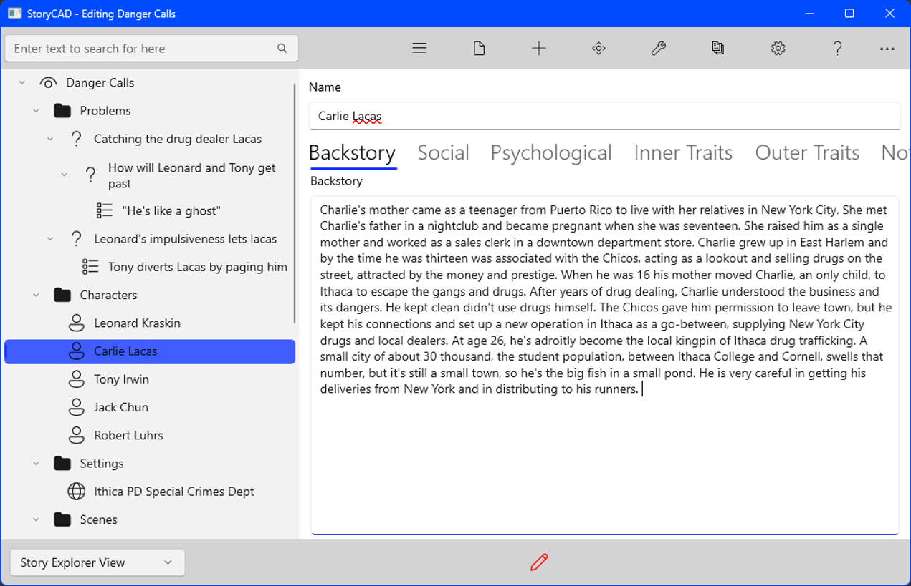

## Creating a Story pt 7 ##
The characters, so far, have been defined by their roles; the only specific traits we've given them (Leonard and Tony) have been shaped by the story's needs.  It's time to put some flesh on these skeletons.  

Let's start with Charlie Lacas.  We know a few things about him.  He's young, he deals drugs, and he uses technology that the detectives don't have.  That absence of technology suggests that the story doesn't take place in a big city.  But perhaps Charlie is a city boy who's figured out that he can use his supplier contacts in New York to deal drugs in a smaller city, say in upstate New York somewhere.   It's safer, the competition is less, and he has an edge over the small-town cops.   This implies that he's fairly bright, which makes him a more worthy adversary for our detectives.  

Going to his Character form, we can start creating some of this, starting with the Role tab:  

We then turn to Psychological considerations:  

Personality Type is based on the theory of enneagrams (see "Personality Type" under "Psychology Tab" in the "Characters" chapter  of this manual for more about enneagrams.)   A stereotype such as this can suggest how the character might react in certain situations.    

Let's also define some Social tab factors:  

The goal of all of this is to create a fully rounded human being, one who is believable and who you can visualize talking and acting in your story.   

The other major consideration is that the character should support the role you've given him.  Had the initial story idea been for a character, you might have fleshed the character out before you started looking for story problems, and then looked for a role to fit the character, but in this case the role came first and the character should fit the part.  

We'll look at one last tab, the Backstory tab:  

There's always a question of how much detail to provide, for characters, problems, settings, etc.  The answer will vary from story to story.  For example, this is an action-oriented story, so the characterizations aren't quite as important.  Whether or not they make it to your writing, the more you know about your characters the better.  

