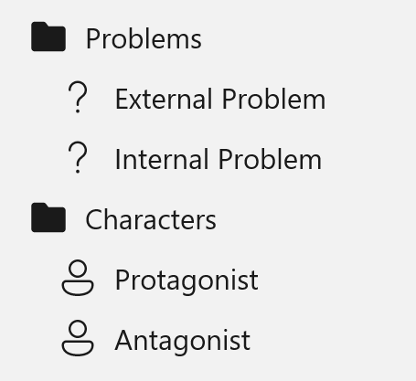
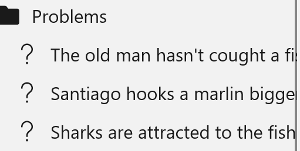
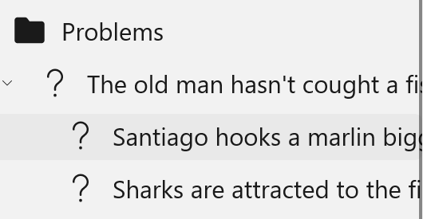

## Defining Problems ##
Defining Problems

In StoryCAD the Problem form is the key to creating an outline. You want to motivate your audience to keep reading or viewing your story, and Problems create suspense and tension through uncertain outcomes. 

StoryCAD’s Problem form is based on three  elements: Goal, Motivation, and Conflict, and is based on the book GMC: Goal, Motivation, and Conflict by Debra Dixon. The goal is what your character wants, the motivation is why they want it, and the conflict is what they’ll have to overcome to achieve the goal. Both your Protagonist and your Antagonist have their goals and motivations, and generally they are each other’s conflicts.
What makes GMC interesting is that it deals with the intersection of character and plot. The literature of the craft of writing often discusses the need for strong characters and of the need for good plots. GMC ties them together. Plot is the character's attempt to overcome the opposition and achieve the goal. The Problem form links to the problem’s protagonist and antagonist, which you must have defined as Character story elements. This leads you further down the wormhole towards fully developing your outline.
The Problem form’s tie to Character forms supports various approaches to story creation. You may start from an idea, concept or situation, and think of your problems more in terms of the events that must unfold (plot-oriented), or you may start from the conception of a character, and find that character’s problem. Your story needs both a plot and characters, and centering on your outline’s Problems can give you both.
Problems server a variety of roles in a story:
Story Problem

As was mentioned under Ideation, one problem is the Story Problem, the spine of the story. The Story Problem’s Protagonist is the Story’s main character. When the Story Problem is resolved, the story’s over.
Outer and Inner Problems

The story's action, the plot, comes from the external events which occur as the characters struggle to reach their goals.  Similarly, character growth and development occurs as characters struggle to reach their goals.  The difference is whether the problem is an outer one or an inner one. 

An outer problem is the character's struggle to achieve some physical goal--- to solve a problem, to win the love of his life, to find a treasure.

An inner problem is some want or need within the character himself, a need to grow or change.  This problem may be some character flaw or psychological hurdle to overcome.  It may be the real reason why the character pursues his external goal, even though the superficial reason he gives is quite different.  The character frequently doesn't know that he has an inner problem at the start of the story, and sometimes, in tragic endings, refuses to acknowledge or resolve the inner problem.

It's often constructive to use StoryCAD to define both an external and an internal problem for your protagonist, with separate Problem forms for each  of them. Both problems help to shape the story's plot. There’s even a Create New Story template for this:

The outer problem asks 'what does the character want?'  The inner problem asks 'why does he want it?'  The outer problem is tangible. The inner problem is intangible, invisible.  The outer problem faces an external adversary.  The inner problem is Man against Himself, usually with something to decide or discover. The outer problem is solved when (win or loose) something is accomplished.  The inner problem is solved when the character grows or changes, or fails to do so.  The inner problem is related to theme. The two problems are connected because your protagonist must come to grips with his inner demon before he can solve the external, outer problem.
Conflict

While we often think we’d like to live our lives with a minimum of conflict, we’re fascinated by the stuff, and our fiction absolutely depends on it.  

Fictional conflict is easy to define: it’s what prevents your character from achieving his or her goal. Picking the right conflicts is arguably the most important decision you’ll make in designing your story. If there’s no struggle, there’s no story. Robert McKee puts it this way: Nothing moves forward in a story except through conflict.

Remember that conflict is only one third of the triangle of Problem. Goal and Motivation, for both your protagonist and antagonist, are equally important. 

Not all conflict will suit your needs. It’s easy to swing towards either of two directions.  At the one extreme is senseless violence, with Black Bart villains and a need for your hero to wear tights and a cape. At the other lies the absence of meaningful conflict, replaced with shallow conflicts which are easily resolved and lead to Pollyanna outcomes.  The right conflicts adds complexity and layers of meaning to your story. 
Crimes of passion and crimes of opportunity are different than the other types of crime. The legal definition of a crime of passion is that it’s committed ‘in a moment of passion’ in response to some provocation. We all known provocation, and have acted in ways we regret in response to provocation. It’s easy to see ourselves  committing  some crimes:  beating up a bully who ‘deserves it’ or the person who cuts us off in traffic. We can also all identify with someone stealing, in order to feed a starving child.
The other crime subcategories are different because they’re deliberate and premeditated. We somehow feel that they’re more organic, a part of the individual’s nature, and it’s interesting to note that those committing these other categories often have characteristics of narcissistic personality disorder. 
But it’s also worth noting that every one of us possess some basic traits of narcissism, such as being self-focused, having a lack of empathy, and desiring power and control, in one degree or another.  We are all potential criminals.
When thinking about conflict in your fiction, you may want to consider two things.

Likewise, solving a conflict doesn’t always resolve a story: if so, many of our novels would be short stories. One problem often leads to another (often less tractable) one. This is what makes The Old Man and The Sea such a beautifully plotted tale.
Complications

 Just as in real life,  one problem often leads to another.  These complications must be causally linked, just as scenes must be. Complications make things worse for your protagonist, escalate conflict, and build toward your story’s climax. 

A good example of this is found in Hemingway's The Old Man and the Sea.  This novelette consists of three sections, each of which is a separate story problem.  In the first problem, the old Cuban fisherman hasn't caught a fish for over eighty days, and the Story Question is 'Will he catch a fish before he starves to death?'  After a struggle, he hooks a giant marlin.  The first problem is solved, but a second problem emerges:  the fish is so gigantic that catching it is doubtful; the Story Question is 'Can he catch the fish?'  After an epic battle he does kill the fish and secure it to the side of his small boat.  But a final story problem emerges when sharks appear and attack the fish.  The Story Question is 'Can the fisherman save his catch and bring the marlin safely to shore?'

Rather than arrange these problems in a list:

You may want arrange them as children of the original problem, which won’t be solved until the complications are:

Where possible, complications should be ordered to make things progressively worse for the protagonist. By the end of the shark attack, the marlin is nothing but a head and tail and skeleton; things can’t get much worse for Santiago.
Conflicts of start at one level and devolve into a more serious one: ‘it’s not a war until the guns start firing.’  Finding your way from inciting incident through middle story to climax is  the process of finding complications, and escalating conflicts is one approach to doing so.  The escalation can occur for many reasons: a character gets tipped over the edge, a ticking clock goes off, a secondary character does something rash, a dropped dish is mistaken for a gunshot.
Subplots

Complications and inner conflicts are two ways in which a story is made richer and more complex by containing more than one problem. A story can also contain problems distinct from the main story problem and which run parallel to it. These often center around characters other than the protagonist. 

A subplot may expand on a character relationship. Romance subplots are examples. The Character form’s Relationship tab explores a variety of possible relationships. The subplot will be one of inner conflict.

In The Old Man and the Sea, a subplot revolves around the relationship between the old man, Santiago, and the boy Manolin. Hemingway writes that Santiago, as mentor, had taught Manolin to fish, and that Manolin loved him. But  at the start of the story, we’re given clues that the relationship has changed:  Manolin now carries the old man’s net, and makes sure that he has enough to eat, while taking care to protect Santiago’s dignity. The subplot’s problem is that Manolin’s parents think Santiago is jinxed, unlucky, and have ordered Manolin to go out on a more prosperous boat. This information is presented at the start of the story, but Manolin’s problem isn’t resolved until the end, framing the old man’s battle with the sea, when Manolin tells Santiago that he’ll fish with the old man tomorrow, for he (Manolin) has much to learn. This character growth by Manolin resonates with Santiago’s epic battle with the Marlin and the sharks.

A subplot may explore or test the protagonist’s goal and motivation by comparison and contrast. One example is the ‘mirror’ subplot, a problem which is similar to the protagonist’s, but with a different outcome. Another is a ‘refusal of the call’ subplot in which a supporting character refuses to participate in your protagonist’s journey.

The one characteristic all subplots (and complications, and inner problems) must face is that they must relate and contribute to the Story Problem in some fashion. Otherwise, your audience will be left wondering why this strange story is embedded in your tale.

Problem Workflow
The Problem form contains four tabs:
Problem Tab

The problem tab identifies the problem in general, and frames it in the form of a question, the general shape of which is ‘Will the protagonist achieve his or her goal?’ In essence, it’s a summary of the problem.

Protagonist Tab 
Antagonist Tab

These two tabs are identical, and both contain all three GMC elements. What differs is the role: Protagonist is derived from a Greek word meaning the main actor (the ‘first actor’); Antagonist (from the Greek words ‘anti’ (against) and ‘agonist’ (actor), is the opposition or foil to the protagonist. Although many problems don’t have human adversaries for your Protagonist (Person vs. Nature, Person vs. Society, etc.), it’s usually a good idea to cast the opposition as a character, or perhaps to create a human character who personifies the opposition. 

The role of Protagonist is not about good or bad; it’s about ‘Whose story is it?’ Your protagonists can be and anti-hero, with few or no hero-like traits. He can even be a villain,  as in How the Grinch Stole Christmas, Dexter the serial killer, or Maleficent from the Sleeping Beauty retelling.

It’s important to understand that your Antagonist has his own Goal and Motivation, and his own Conflict: his opposition is your Protagonist. It’s been said that no man is a villain in his own eyes. That may or may not be true, but he will certainly have his reasons for his behavior, even if they’re rooted in abnormal psychiatry.  Of But a villain’s motive may be more relatable, rooted in greed, humiliation, pride, anger, or heartache.  A common characteristic of villains is that they’re in over their head: a small mistake grows larger over time.

StoryCAD includes a tool, Conflict Builder, which describers conflicts into categories and examples from the world of conflict resolution that go beyond creating a cardboard ‘bad guy’ adversary.
Resolution Tab

The resolution is the outcome of the problem. Outcomes can be generalized into 'successful' or 'not successful', but the choices listed for this story element are more useful.  They represent story patterns which recur throughout fiction.

The outcome is the actual results or end of the problem.  

The generalized outcomes are:

Protagonist obtains goal
 The protagonist should be a sympathetic character with a worthwhile goal, who solves her problem through her own efforts.

Protagonist  reaches decision
The sympathetic protagonist must decide between two courses of action.  The complications are from making the  wrong choice.  At the end she reverses and chooses correctly, leading to a happy ending.

Protagonist  'comes to realize'
The initial situation has the protagonist feeling depressed, guilty or anxious.  The turning point results in her being made aware that things are not as bad as they seem.

Protagonist  abandons goal
The sympathetic protagonist has a destructive goal such as revenge.  At the turning point he realizes that his goal is no good and abandons it.

Protagonist is rehabilitated
The protagonist is dominated by a negative trait.  The crisis shocks him into rehabilitation.  This outcome is common in confessionals.

Villain is foiled ('biter bit')
The protagonist must be a villain, with a goal which will have ruinous effects if achieved. bring disaster to a sympathetic goal.  The hero is the antagonist who opposes him, in a role reversal.  At the crisis, when things are darkest, the protagonist seems to win, but the outcome is a reversal to a defeat.

Protagonist  declines morally
The protagonist must start with some good qualities and hope of a good outcome, but at the moment of crisis he declines.  The seeds of the negative trait which dooms him must be present from the start.

Protagonist is defeated
The sympathetic protagonist has a desirable goal, but is defeated in the end.  This is true tragedy.  The Conflict Type is often 'Person vs. Fate' or 'Person vs. Society.'

Villain is successful
Frequently the villain is a Trickster who succeeds through cleverness.  This outcome is common in comedies.

Protagonist fails to realize
The protagonist doesn't adapt to changes in the story situation due to denial or stubbornness.  A tragic ending of lesser drama.

The Method control on the Resolution tab of the Problem form identifies the means by which the protagonist tries to achieve his goal.  The examples are some of the methods used in many stories.

As with all story elements, the more specific, the better.  You might change 'Pleads for another chance'  with  'Pleads for a chance to fight Apollo Creed.'

  
  
[Previous - Problem and Character Development](Problem_and_Character_Development.md)  
[Next - Defining Characters](Defining_Characters.md)  
