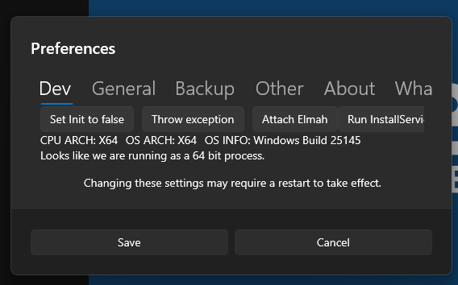

Developing StoryCAD
If you are a C# developer and are somewhat familar with WinUI (or another XAML based UI language) then you can contribute to StoryCAD (Which is written in C# and uses WinUI 3).
For more information about contributing, please check the GitHub Repository.
Developer only menus / pop-ups

If you have cloned StoryCAD to a separate repo and built it for the first time then you may be surprised to see this screen. It indicates a key file related to licensing is missing from your local clone. These licenses are in effect for the storybuilder.org repo only. The missing licenses won’t cause any issues with the app functioning, but your copy won’t report errors via Elmah.io and you may see pops relating to syncfusion licensing errors.
Regardless, congratulations on successfully compiling StoryCAD.

If StoryCAD notices you have a debugger attached to the process, the developer menu will appear.
This shows info about the computer and may contain buttons to test some parts of the StoryCAD.
If running without a keyfile (which is standard for those contributing to the StoryCAD project.) then some of these buttons may not work or cause intended behavior.

As such this menu may be removed, updated or abandoned at any point.

Developer Notes
- Single Instancing whilst debugging in VS does work however the window may not be brought to the front and may only flash as VS will attempt to hide it again if it wasn’t shown, to test Single Instancing releated stuff do the following:
	- Run the app in VS (or Deploy.) so that it installs the app on your system.
	- Close the app.
	- Now launch the app from elsewhere (Such as the start menu or taskbar)
	- Hide the app behind other windows or minimise it
	- Attempt to launch the app again
	- The first instance of the app should now be brought on top of all the window

