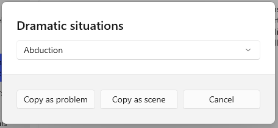

### Dramatic Situations ###
Dramatic Situations

Georges Polti, in his 1895 book The Thirty-Six Dramatic Situations, proposed that there are only a limited number of dramatic situations, based on fundamental human conflicts.   He defined each of his situations in terms of dramatic elements and examples.

In 2017 Mike Figgis, whose film credits include Internal Affairs and Leaving Los Vegas, revised and republished The Thirty-Six Dramatic Situations, adapting the dated examples from long-forgotten writers Polti used to the more modern era, and borrowing examples from cinema. This is the source we use. 

The Dramatic Situations form is invoked from the Plotting Aids sub-menu of the Tools menu.  It contains the thirty-six dramatic situations and the dramatic elements of each.

The central story problem will frequently be based upon one of these situations, but the Dramatic Situations tool is intended more for use with the plot outline and with scenes.  Every scene can be thought of as a 'little story' with its own conflict; and each scene will therefore generally involve one or more of these dramatic situations.

This tool works with the Scene tab on the Plot form to help define the conflict for a scene.  If you select Copy from the Dramatic Situations form, the elements of the situation you have selected will be copied into the elements on the Scene tab of the Plot form for the currently selected plot point.

  
  
[Previous - Master Plots](Master_Plots.md)  
[Next - Stock Scenes](Stock_Scenes.md)  
