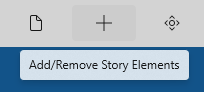

Menu Bar

The Menu bar is located just below the title bar on the StoryCAD form and provides access to StoryCAD’s common tasks.

Hovering your mouse or stylus over a button will display a tool tip describing the button’s function:

The menu bar buttons either display drop-down menus (such as File), or launch particular actions (such as Preferences.)

[Search](Search.html)   
[Show/Hide Navigation Pane](Show_Hide_Navigation_Pane.html)   
[File Menu](File_Menu.html)   
[Add/Remove Story Elements](Add_Remove_Story_Elements.html)   
[Move Story Elements](Move_Story_Elements.html)   
[Tools Menu](Tools_Menu.html)   
[Reports](Reports.html)   
[Preferences](Preferences.html)   
[Key Binds](Key_Binds.html)   
