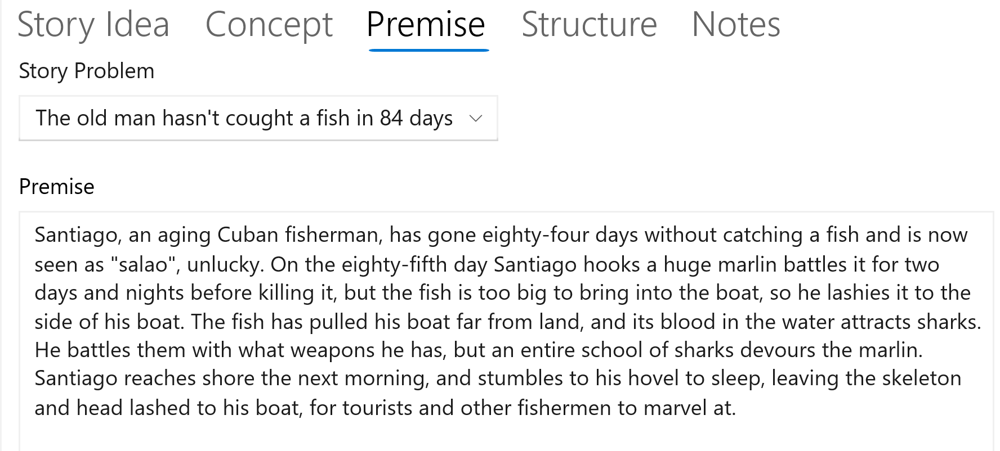
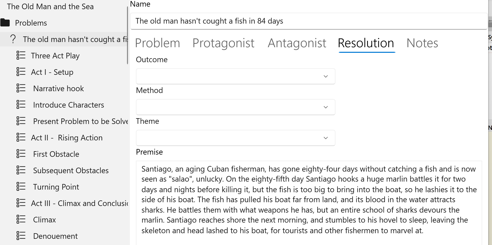
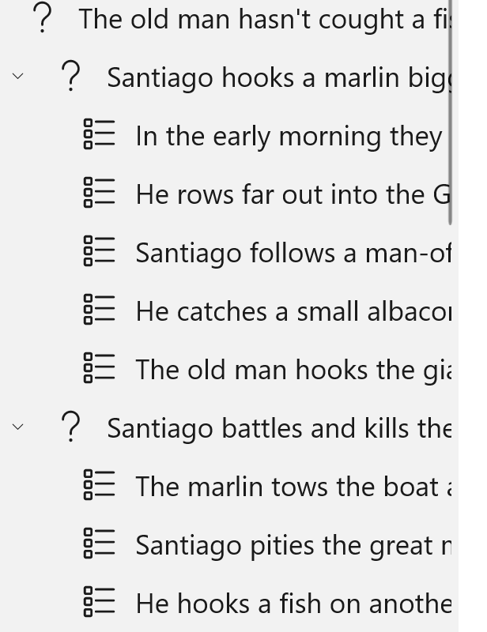
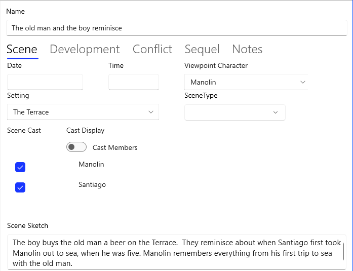

Using StoryCAD to Plot Your Story

Storytelling with Purpose

A story is written as a sequence of scenes (in StoryCAD, Scene story elements.) A scene is an event, and the events are causally related: one event causes, and leads to, the next. For example:

The Queen is told by her mirror that Show White is now the fairest in the land, 
so she orders her huntsman to murder Show White and bring her the child’s heart,                     
but Show White pleads for her life, 
            so The huntsman spares Show White, abandoning her in the woods,
            and he tricks the Queen by bringing her the heart of a wild boar.

Coming up with these scenes is an act of imagination- it’s storytelling, play acting, in which you take on the part of one character and then the other.

In the previous topic Plotting In Scenes, we introduced the idea that every scene must advance the story’s plot: it must move toward the resolution of the story problem it’s a piece of.  This is another way of saying that every scene must have a purpose: show the Ordinary World, introduce the problem, resolve the conflict. A scene can and usually does have more than one purpose, but  must always contribute toward solving the Problem  it’s a part of; otherwise, the story will meander aimlessly. A plotted story must aim toward its outcome as an arrow flies towards its target. Think of each story problem as having structure, of consisting of plot points or story beats. Each plot point is a potential scene, and the plot point’s function is that scene’s purpose.

Scene Count (Story Length)

A frequent concern when plotting at the scene level is story length, which can be rephrased as ‘How many scenes do I need?’ As with many writing questions, this one has more than one answer. 

You can estimate your scene count by dividing your target story (novel, short story, script) word length (or playing time) divided by the average scene word count (or playing time.) If you’re writing a novel and shooting for 100,000-120,000 words, and your scenes average 2,000 words, you’ll need 50-60 scenes. In terms of three-act structure, a quarter of them might go to Act I, a  half to Act II, and the remaining quarter to Act III.

Finding Scenes

How do you go about finding those 50-60  (or however many you need) scenes?  

Don’t think in terms of scene count. Think of plotting as finding the scenes you need to resolve your story’s problems.  If you’ve been following this dialog, you know that you  have a top-level problem, the Story Problem, defined on the Story Overview form, and you’ve summarized the problem in its Premise:

 When that problem is resolved, the story is finished. This is the top level design of your story.

If you were to use Master Plots to create of Scene story elements for the plot points in this problem with the Three Act Structure template, it might look like this:

This is what plotting the main Story Problem might look like if it were, say, a short story. But it’s longer story (a Novella, in this case), and there aren’t enough scenes to carry the longer work. So instead of thinking of each part as  a scene, consider it just as a story beat or plot point. Ignoring the other plot points, consider First Obstacle and Subsequent Obstacles not as Scenes but as Problems= subproblems, Complications, in this case):

In real life one strategy to solve a problem is to decompose it into smaller problems. That same approach works when plotting, the twist being that you’ll be creating rather than solving subproblems. Don’t plot in Scenes;  plot in Problems. These problems can be further decomposed into scenes:

This process works not only with complications (subplots with bad outcomes which are designed to increase the conflict), but with other subplots. In The Old Man and the Sea, Manolin, the boy Santiago mentored and who loves him, has a character arc based on his relationship with the old man:

This is an inner problem for Manolin, a coming of age arc, and it’s plotted in just six scenes:

Hemingway uses this problem as a frame around Santiago’s battle, splitting the scenes and using the first three to introduce Santiago before his battle, and the last three to show Manolin vowing to fish with the old man again. Plot your scenes for your Problems, but you don’t have to arrange them in that order in your narrative. That’s what Story Narrator View is for.

Eliminating Scenes 

A quite different answer to the ‘How many scenes?’ question is ‘As few as possible’, following Robert Heinlein’s adage: “The most important lesson in the writing trade is that any manuscript is improved if you cut away the fat.” Or, if you prefer, William Faulkner’s: “In writing, you must kill your darlings.”

The urge will be to create a scene for every plot point.  But you have a wonderful tool at your disposal, your reader’s imagination. If you can remove a scene and the reader can follow your story line, that thing can and should be cut.
