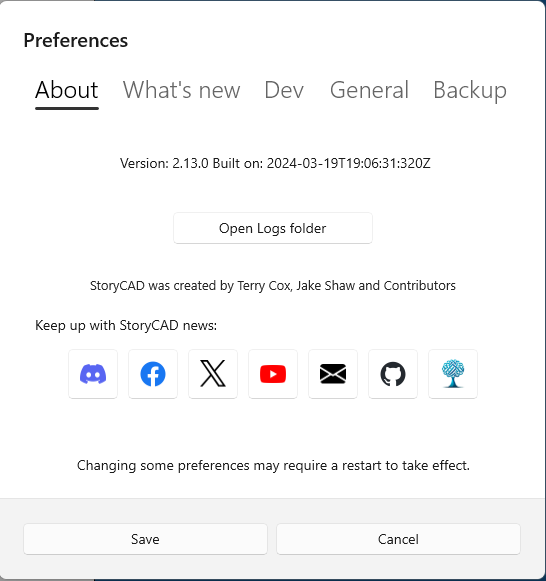
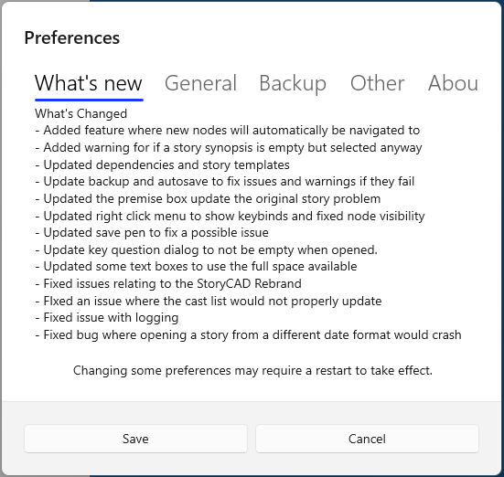

# Preferences #
Preferences

The Preferences Dialog will be displayed when you press the Preferences button on the Menu Bar:

The Preferences Dialog contains many options. It’s divided into a series of tabs which group the functions.

General tab:

The name field is used as the default Author on the Story Overview form on new outlines.

The name and your email address are used as your StoryCAD userid. The email address is also used with the elmah.io and newsletter options if you select those.

The project directory is the default directory for new story outlines.

Here are a list of the options (Besides information fields such as name, email etc.)

Backup tab:

StoryCAD backups are  zip files containing your .stbx outline. 

The backup directory is the folder which will hold your backups. It holds a subfolder for each outline (.stbx file) you’ve backed up; the subfolder has the individual backups of your outline:

Make a backup when a story is opened - Makes a backup when you open a story

Make timed backups - Makes a timed backup every so many minutes.

Backup Frequency - How often a timed backup should be made in minutes.

Other tab:

Send error logs - This option uses a service, elmah.io, which collects error data and provides us with a log which gives us an idea of what happened. This information includes your your email so that we can follow up for more information if needed. Your outline data is not not retained or forwarded and no
information is shared with anyone outside of Team StoryCAD.

Send newsletters - Your email address will be subscribed to the StoryCAD newsletter, which is usually sent about once a month.

Wrap node names - Wraps node names in the Story Explorer and Narrator treeviews, if the Name is longer than the treeview’s display width.

Automatically Save - This function will automatically save your story  story outline every X seconds. It operates exactly as if you’d used File > Save or clicked on the edit button on the status bar.  You’ll see a verification of the save event on the status bar and the edit button will turn green. 

Preferred Search Engine - This is the search engine that will be used within web nodes.

Preferred Theme - This is the theme that StoryCAD will use. You can select between Light Theme, Dark Theme or to Use System theme, which will match the theme you have set within windows.

About tab:

This tab identifies the current version and has links to keep up with StoryCAD on Social Media. You can also review StoryCAD here; additionally, you will also be prompted to review StoryCAD roughly once every six months.

The logs folder is a subfolder of the installation folder. It contains a list of the most recent log files written by StoryCAD (one file per day.)

These files contain operational logs of StoryCAD sessions and if you’ve enabled exception reporting we may ask you to forward the log relevant to a reported exception, at your discretion.

The Discord server is the community meeting place for StoryCAD users; we urge you to join us.

What’s New tab:

The What’s New tab displays the Changelog for the current release. 
  
  

  
  
[Previous - Reports](Reports.md)  
[Next - Researching your story](Researching_your_story.md)  
