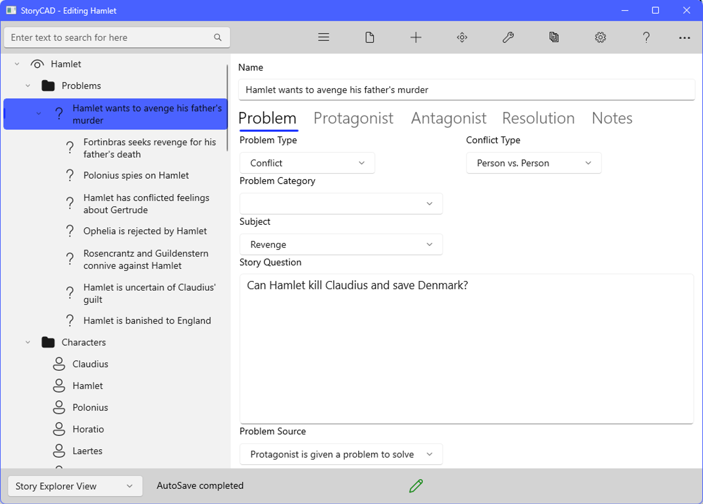

### Problem Tab ###
Problem Tab

This tabs contains elements which help to define a story problem.

Problem Type

There are three problem types:

Conflict	         The protagonist has a goal or objective, but something or someone (the antagonist) opposes the achievement of this goal.  The protagonist and the antagonist struggle until one or the other wins.

Decision	         This problem pattern ends with the protagonist making a difficult and important decision.  The problem is a choice.

Discovery	          The protagonist eventually makes a not too obvious discovery.  The discovery, which is the story's resolution, represents a change for him.	

Conflict Type

The nature of the antagonism between protagonist and antagonist.

Human vs. Nature       The protagonist eventually makes a not too obvious discovery.  The discovery, which is the story's resolution, represents a change for him.

Person vs. Person        The struggle may be two characters contending for the same prize, one person out to get another, or Odd Couple stories of characters with opposing traits, or ideological.

Person vs. Himself      The protagonist is his or her own antagonist.  The antagonistic side may be a destructive trait or habit, such as an addiction, or two opposing traits might fight for control in one soul.

Person vs. Society       ...In the form of prejudices, taboos, or traditions.

Person vs. Situation     This is typical of Underdog master plot stories; the situation is an overpowering juggernaut such as a war, poverty, the 'system', or a corrupt organization.

Person vs. Fate            Fate (old age, death, evil, etc.) is usually personified or illustrated as a character.

Person vs. Machine     The Machine's role may be as a symbol (for example, of dehumanizing society).  Pinocchio and Frankenstein are the archetypes of Person vs. Machine stories.

The terms 'human' and 'person' in these labels means that these roles are humanized, not that they must be humans.  The protagonist can be a dog, a wooden puppet, or a hobbit, but the reader must be able to identify with the character's humanity.  

Subject

This control identifies the basic area or type of problem.

The Subject control lists many of the common types of problems encountered in fiction.  

The problem subject should be as specific as possible.  If you start with a generic subject from the list, make it unique.  Instead of 'Being Hunted', you might say 'Chased by Lieutenant Girard.'

Story Question

The primary reason your reader reads your story is to find out how it comes out, to find the answer to a question the story poses.  It's useful to clarify exactly what that question is.
The story question can be framed as a yes or no question in terms of the protagonist's goal: 'Will Scarlett manage to save her plantation?', or 'How will Macbeth prove that his father was murdered?'

Consider whether the reader should know the story's outcome prior to the climax scene.  In many character-oriented stories the answer should be yes, and the story's dramatic arc deals with how things happen rather than what will happen.  If the answer should be no, the story question is the essential suspense of the story, and your plot must serve to keep the outcome in doubt.

Source of Conflict

This control identifies the beginning or origin of the problem.

Think of the story as a flow from a state of equilibrium (the way things were before the action started), through a state of change (the story itself) to a new state of equilibrium (resulting from the story's resolution.)  Source of Conflict identifies how the original equilibrium is shattered, and why a change is necessary.

The Source of Conflict is useful in identifying your story's point of attack, the opening scene.

The provided choices are generalized sources from which many problems spring. Be specific.  If you start with a generic source, replace it with one specific to your story and your protagonist.  Instead of  'Protagonist wants to change his situation'', say 'Joe wants to escape his poverty.'

  
  
[Previous - Problem Form](Problem_Form.md)  
[Next - Protagonist Tab](Protagonist_Tab.md)  
