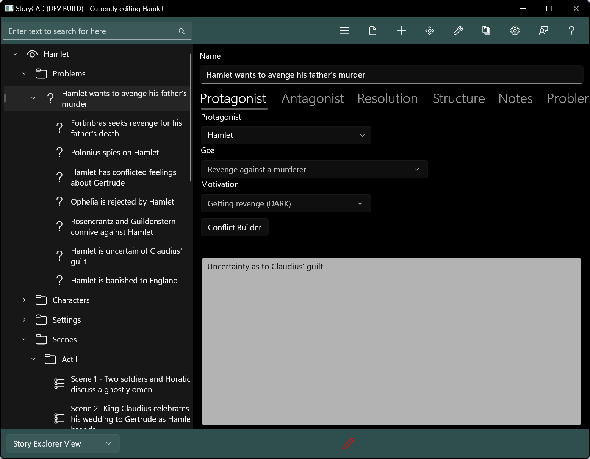

### Protagonist Tab ###
Protagonist Tab

The  protagonist is the character who has the problem.  The protagonist of of the story problem is the main driver of the plot.  In the case of a subplot, that problem's protagonist may be a different character than the story's protagonist.

Protagonist	

This is a list of the characters who have been defined on the Characters form.  Select one of these characters from the list as your protagonist.

Goal

Motivation

In real life, things sometimes just happen.  In fiction, with few exceptions, they happen for a reason.  Motivation should be closely related to the story's Outcome and to the Theme.  The clash of motives is the abstract counterpart to the concrete conflict between protagonist and antagonist, and provides thematic significance to the story.

Motivation is closely tied to character--- it could be thought of as the place where character and plot meet.  The psychological and social factors, traits, back story, and the motivation of your character must all be consistent.   Deep motives can only change as a result of character development or growth.

The list of provided motivations is not meant to be exhaustive, but covers many of those found in literature.

As with many other controls, you can modify the motivations listed to suit your own needs and interests.  See "Customizing StoryCAD" for details.

Goal

The Goal is the result or end toward which the character's efforts are directed.

As with all story elements, the more specific the goal, the better.  The Goal control lists a number of generic goals, which is certainly not a comprehensive list.  Even if one of these is selected, you should convert it into a specific desire: rather than 'To find a missing object', your goal should be 'To find the Maltese Falcon.'

  
  
[Previous - Problem Tab](Problem_Tab.md)  
[Next - Antagonist Tab](Antagonist_Tab.md)  
