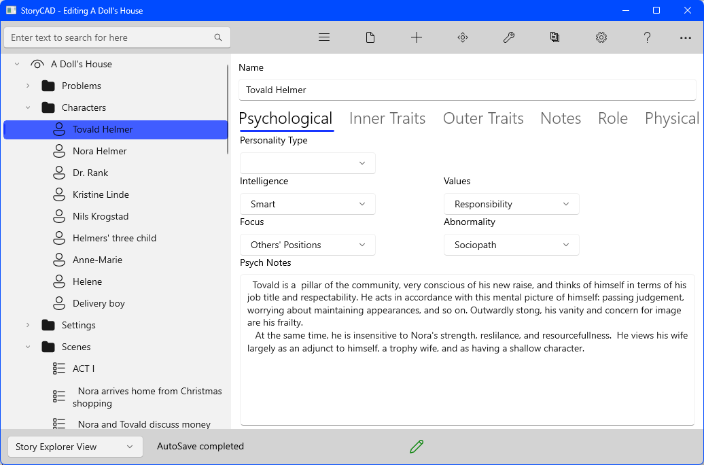

### Psychological Tab ###
Psychological Tab  

This tab contains information about the mental states and processes of the character.  

Personality Type  

There are a number of methods for classifying people according to personality type.   For example,  Aristotle classified personalities according to 'humor', or temperament, into four categories: melancholic, sanguine, emotional, and phlegmatic.  Carl Jung classified people as introverted or extroverted, and also used four categories: sensation, thinking, feeling, and intuitive. StoryCAD uses the Enneagram.  This system is very old, and is believed to have  originated with the Sufis in the Middle East.  It groups people into nine types ('ennea' is Greek for the number nine.)  The system teaches that people in a given type often behave and react in similar ways.  

You may wish to use personality types to better understand what motivates your characters, and how they may think and feel in certain situations.  But remember that a personality type is just a stereotype.  No two people are alike: one may be an only child; the other, the youngest in a  large family.  One could be born to poverty, another to luxury.  Each character is shaped by different experiences.  

Intelligence  

Intelligence is the capacity to grasp meaning.  Action-based stories generally  require less intelligence in the protagonist than do character-based stories.  A character who reacts, rather than acts, can be less intelligent.  

The antagonist should generally be as intelligent as the protagonist, to insure a fair struggle.  

Values  

People can have vastly different ideas of what is right or worthwhile in life. These 'governing values' are seldom articulated, but maintaining and defending them is a large influence on an individual's behavior, because her self image is tied to the values she holds.  

In real life, people have multiple values.  In fiction, it's more useful to think in terms of just one or two values.  Conflict can be created by threatening your character's important value,  by giving her two opposing or exclusive values, or by destroying or removing a value.  

Another way values can cause conflict (and therefore stories) is through misalignment of Values and Focus.  For example, if a man values his family, but spends too much time earning money to support them,  this can cause problems.  

The choices for this trait represent common values people hold.  Be aware that different social backgrounds (especially different cultures and educational experiences)  may have profound effects on values.  

Abnormality  

This control describes the abnormal mental state of a character.  

The line between normal and abnormal behavior is one of degrees.  Nor should you restrict unusual behavior to your villains.  A touch of abnormality adds color and unpredictability to a character.  

Abnormal behaviors are complex and difficult to describe.  Be sure to research the specific illness you're using carefully.  

Focus  

The character's Focus is where he places his attention and activity.  His Focus (along with his Values) determine what's important to him.  From the perspective of plotting, these frequently determine what's at stake for the character, and therefore what should be put at risk--- in other words, what the story problem should be about.  

A character's Focus and his Values can be at odds, as a source of conflict in the story.  
The character may discover that what he thinks is important isn't, or that values and focus he has neglected are truly important to him.  Stories of discovery and decision are often concerned with these traits.  

  
  
[Prev](Social_Tab.md)[Next](Inner_Traits.md)  
