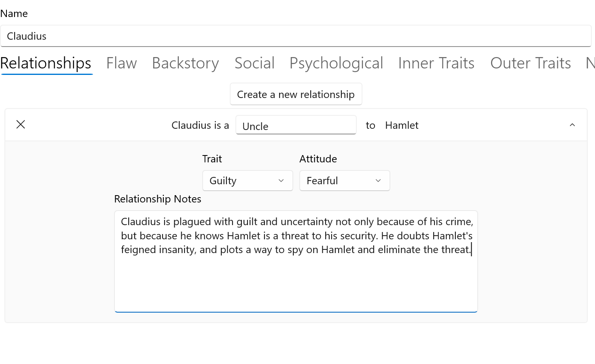

 Relationships Tab

The Relationship tab on the Character form describes significant character-to-character relationships.

Relationships are made when two people with a different set of values and often varying personalities come together. Relationships in fiction (and in life)  can be a source of conflict.

Most stories involve interactions between characters: adversarial, social, familial, romantic. A character in a relationship is distinct from a character as an individual; the relationship is a dynamic. Characters in a relationship behave differently when they’re together- a sort of role.

This tab is only one half  of the relationship; go to the Relation character  to define  the other half. Be aware that the two sides of a relationship seldom have the same dynamic.

Create a new Relationship

Click on this button to add a new relationship:

Relation Type

Select the type of relationship from the ‘is a’ ComboBox. If you can’t find the one you want, add a new one.

Relation

Select the character the relationship is with from the ‘to’ list of characters.

Make a relationship on the other character

Check this box to define the inverse relationship. To complete that relationship, however, you must navigate to the other character.

Once you’ve added a relationship, you can update its defining details:

Trait

Select from list of traits, or add your own.

Contrasting qualities tend to pull or push characters apart.

Attitude

If the trait is the external behavior defining the relationship, attitude is the internal counterpart, often a feeling.
If a Character has a character arc of growth centered on a relationship, it’s often about an evolution of attitude.

Notes

Use this field to record your ideas and observations on the relationship.

Remove Relation button
 
If you click on the ‘X’ button on a relationship, you’ll be asked to verify that you wish to remove that relationship.

Show and Hide a relationship

If you feel that the relationship takes too much space up you can hide the extra info (Traits, Attitude and notes) by click the little arrow in top right of the relationship. You can click the arrow to show this info again.

  
  
[Previous - Appearance Tab](Appearance_Tab.md)  
[Next - Flaw Tab](Flaw_Tab.md)  
