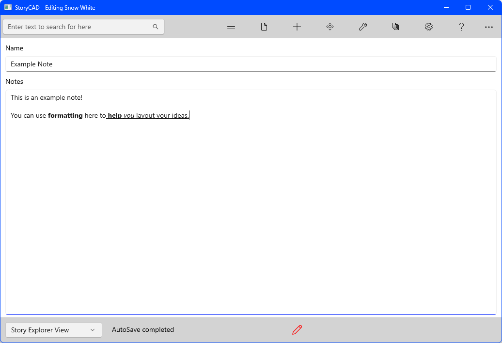

{: .no_toc .text-delta }

Notes Form

Notes forms can be used to store any information you wish anywhere in the outline, this can be useful for writing down background information about your characters.

