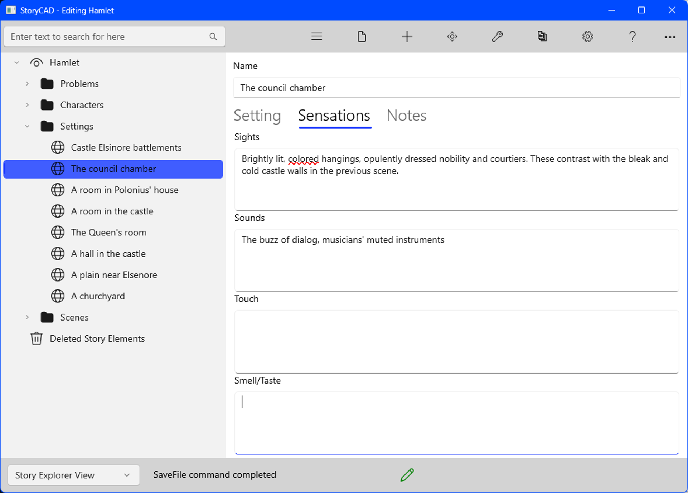

### Sensations Tab ###
Sensations Tab

Your reader can only experience your settings through the eyes and ears of your characters.  To make the setting as effective as possible, you must explore the impressions the setting makes on the five senses. This tab is a reminder to do so.

Fields:

Sights
This control deals with color, size and enclosure, lighting, texture, and contrasts.

Sounds
Sounds have attributes of loudness, tone, complexity, and direction.  The sounds of voices are of special importance: dialog is a character key. But these are setting sounds: bells, cars and trains, barnyard sounds, the rustle of trees in the woods.

Touch
This control deals with tactile sensations such as texture, temperature,  or pain.  Physical contact between characters, from the embrace of lovers to a father resting his hand on his son's shoulders, is especially important.

Smell/Taste
The other senses are often neglected but can be very important.  Smells in particular can be effective in pulling a reader into a story; the sense of smell is primitive and powerful and taps into deep emotions.

    
[Previous - Setting Form](Setting_Form.md)  
[Next - Setting Form](Setting_Form.md)  
