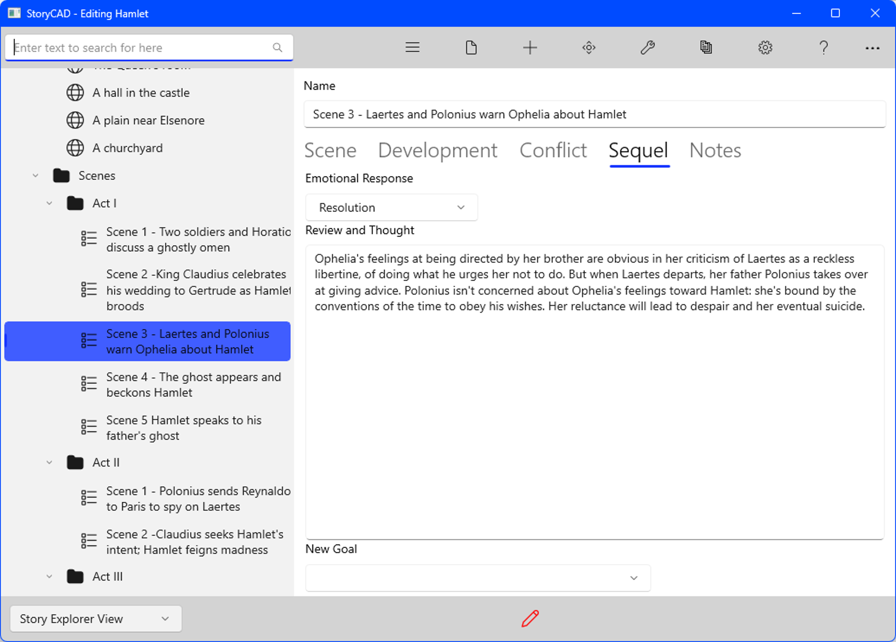

Sequel Sequel Tab
Sequel Tab

The prose which immediately follows a scene usually ties that scene to the next.  The two literary devices which serve this purpose are the transition and the sequel.

A sequel is told from the viewpoint of the scene's protagonist and describes his reaction to the events in the scene.  The reaction follows a repeatable pattern.

Emotional Response	First there's an emotional response.  Since most scenes' outcomes are setbacks, this is frequently shock, disbelief, anger, etc.

Review and Thought	As the emotions ebb, the character will begin to reflect on the events in a more dispassionate and logical manner.  He may recall other and earlier information.  This period of review and thought is a good place to put back story.

New Goal		The period of thought leads to a new plan, by which the protagonist can overcome the setback of the previous scene.  This new goal is in turn the scene's goal for the next scene, which propels the story forward.

See "Scene and Sequel" for more information.

