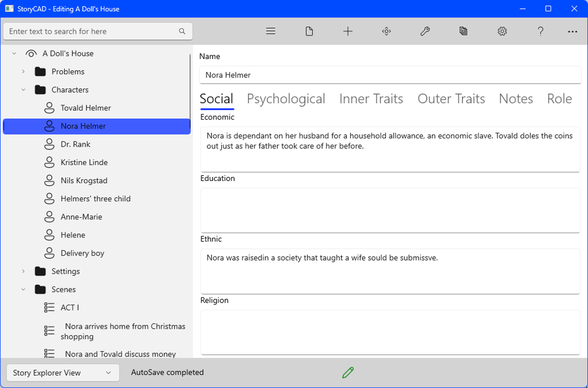

### Social Tab ###
Social Tab

These elements are the major factors which affect this character's behavior and which come from the influence of others or the community.

The four socializing factors on this tab are important, but there is another, equally important source of social influence: specific relationships with other people.  Parents are notable examples.

Social factors may act as a source of story conflict, either externally with another character or characters, or internally within the character, war with each other in character, when contradicted by events or learning. , as a source of story conflict.  For example, a young white boy might have been raised to dislike or distrust blacks,  but the positive influence of a particular person of color  could conflict with that background.  This type of conflict is common in 'Man against Society' stories.

Fields:

Economic Status

Use this field to hold information about the economic/financial status of the character.

In considering this trait, consider wealth as a form of freedom; the poor are often shorn of choices which the wealthy enjoy.

However, wealth can also serve as an insulator, which isolates a character from real life. This is true more of inherited than earned money, so also consider how any wealth was acquired.

Changes in economic status can be powerful sources of conflict.

Education

Use this field to hold information about the character's education.

Education is a primary means of social mobility, or rising above poverty or humble beginnings.  But education is also sometimes associated with class separation, snobbish behavior, and lack of worldliness.

In either roll, positive or negative, education can place a character in conflict with his previous (before school) environment.

Ethnic and Cultural

Use this field to hold information  about the ethnic and cultural background of the character.  These factors can provide great color and variety to stories.

Be sure that you know the ethnic group or culture you're writing about, either from experience or from careful research--- or both.  
 If you don’t know the group you’re writing about, get to know multiple members of that group. 

Be wary of stereotyping.  In fact, interesting characters often come from providing character traits which are at deliberate odds to stereotypes.

As with other social factors, changes in the ethnic and cultural environment can provide a source of story conflicts.  This happens in situations in which a person moves from one social group or strata to another,  such as from employment, travel, or marriage.

Religion

Use this field on the Social Background tab of the Character form to hold information about the religious background and status of the character.

Religion is not widely used in fictional character development except in religious market genres.  Characters frequently express religious beliefs, but don't show or act upon them except in unusual circumstances.

But religion can provide a foundation for characters in crisis, a source of comfort and strength when things are at their darkest. Consider It’s a Wonderful Life. A religious background can provide the basis for character choices at the turning point.  This is especially true for stories in which the protagonist is on the brink of a fall into immoral or unethical behavior. 

  
  
[Previous - Backstory Tab](Backstory_Tab.md)  
[Next - Psychological Tab](Psychological_Tab.md)  
